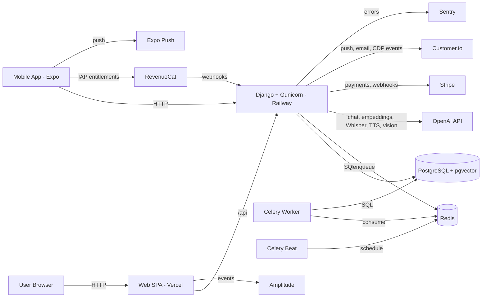
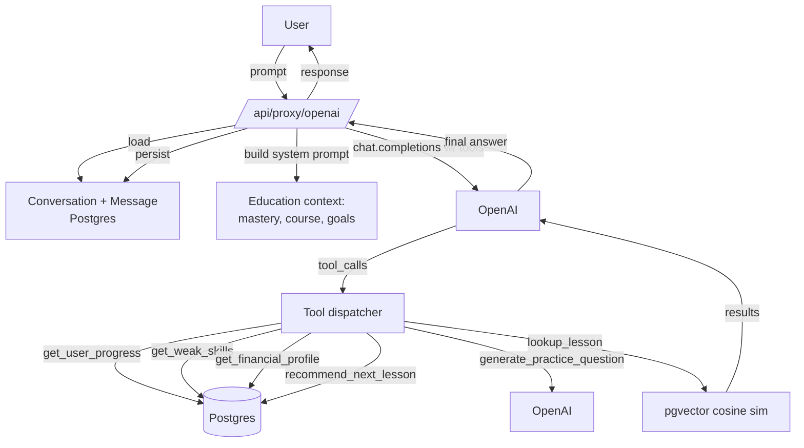

# Architecture overview

Garzoni is a pnpm-monorepo SPA + native app + API + workers, with an AI tutor layer powered by OpenAI and pgvector.

## Components

- **Web (`frontend/`)** — React 19 + Vite + Tailwind, served by Vercel.
- **Mobile (`mobile/`)** — Expo SDK 54 (React Native), distributed via App Store / Play Store. RevenueCat for IAP.
- **Shared core (`packages/core/`)** — TypeScript: API client (axios), services (auth, AI tutor, entitlements), hooks, types, i18n locales (EN + RO). Imported by both `frontend` and `mobile`.
- **Backend (`backend/`)** — Django 4.2 + DRF, Gunicorn, hosted on Railway. JSON API + Django admin.
- **PostgreSQL** — Primary datastore; **pgvector** extension for AI semantic search.
- **Redis** — Celery broker + Django cache (entitlement counters, conversation summary triggers, AI nudge rate limits).
- **Celery worker + beat** — Background jobs: weekly digests, streak resets, transactional emails, AI nudge generation, embedding backfill, daily personalized-path re-eval.

## Diagram



## Tech stack

| Layer          | Tech                                                                                                                        |
| -------------- | --------------------------------------------------------------------------------------------------------------------------- |
| Web            | React 19, TypeScript, Vite 6, Tailwind 3.4 + SCSS, React Router v7                                                          |
| Mobile         | Expo SDK 54, React Native 0.81, Expo Router, expo-av (voice), expo-image-picker (scan), react-native-purchases (RevenueCat) |
| Shared         | TypeScript core package (axios client, React Query helpers, i18next)                                                        |
| State          | Zustand (client), React Query (server), React Context (theme, auth)                                                         |
| UI system      | Custom glass morphism: GlassCard, GlassContainer, GlassButton                                                               |
| Animation      | Framer Motion, Three.js (landing globe), Lottie, Canvas Confetti                                                            |
| Rich text      | CKEditor 5 (lessons), react-native-render-html (mobile)                                                                     |
| i18n           | i18next (EN + RO); locale source-of-truth in `packages/core/src/locales/`                                                   |
| Backend        | Django 4.2, DRF, Celery 5, Redis 5, PostgreSQL 15+, pgvector                                                                |
| AI             | OpenAI Python SDK (gpt-4o-mini, gpt-4o, text-embedding-3-small, whisper-1, tts-1, gpt-4o vision)                            |
| Auth           | JWT (simplejwt), Google OAuth (web + mobile), Sign in with Apple (mobile), reCAPTCHA Enterprise on sensitive endpoints      |
| Payments       | Stripe (web), RevenueCat → Apple/Google IAP (mobile)                                                                        |
| Comms          | Customer.io (CDP + transactional + push), Resend (email), Expo Push                                                         |
| Observability  | Sentry (web + Django), Amplitude (web analytics)                                                                            |
| Deploy         | Vercel (web), Railway (backend, Postgres, Redis), App Store / Play Store (mobile)                                           |
| Static / media | WhiteNoise (Django statics); Cloudinary (lesson images, avatars)                                                            |

## Key directories

```
garzoni/
  frontend/src/
    components/    # 141+ React components
    contexts/      # ThemeContext, AuthContext, AdminContext
    hooks/         # Web-specific hooks
    routes/        # AppShell, AppRoutes
  mobile/
    app/           # Expo Router screens (chat, voice-chat, scan, lessons, dashboard)
    src/
      components/  # RN components
      theme/       # ThemeContext (mirrors web tokens)
  packages/core/src/
    services/      # apiClient, aiTutor, authService, entitlementsService, userService
    hooks/         # Shared React Query hooks
    types/         # API types
    locales/{en,ro}/  # i18n source-of-truth (common.json, shared.json, courses.json)
  backend/
    authentication/  # User, UserProfile (financial profile fields), Apple/Google OAuth
    education/       # Lessons, courses, Mastery, ContentEmbedding (RAG), PathPlan, AI tutor service
    finance/         # Stripe, paper trading, FunnelEvent, market-data proxies
    gamification/    # Streaks, hearts, missions, rewards
    notifications/   # Customer.io integration, push, transactional email, AI nudges Celery beat
    onboarding/      # QuestionnaireProgress (financial profile capture)
    reports/         # Internal reporting
    support/         # AI conversation persistence, OpenAI service with tools, voice + scan endpoints, smart resume
  docs/              # This directory
```

## AI tutor architecture

The AI tutor is a stateful agent layer wrapping OpenAI:



- **Tools**: `support/services/tools.py` defines 6 function-calling tools.
- **System prompts**: centralised in `support/prompts/tutor.py` with a `PROMPT_VERSION` for cache-busting.
- **Persistent memory**: `support.Conversation` + `support.Message` (one conversation per user × source); rolling summary above 3k tokens.
- **Quotas**: per-plan daily cap (5 / 50 / 200) + per-user daily token budget (Redis).
- **Model tiering**: `gpt-4o-mini` for Free/Plus, `gpt-4o` for Pro.
- **RAG**: lesson + course content embedded with `text-embedding-3-small`, stored in `education.ContentEmbedding` (JSONField for now; pgvector column when available).

## Reading order for new contributors

1. Top-level `README.md`
2. This file
3. `docs/environment.md` — env vars
4. `docs/setup-local.md` or `docs/setup-docker.md` — local dev
5. `docs/exercise-experience-plan.md` — UX targets
6. `docs/subscription-matrix.md` — entitlements model
7. `docs/LEGAL_ANALYSIS.md` — data flows (for compliance work)
