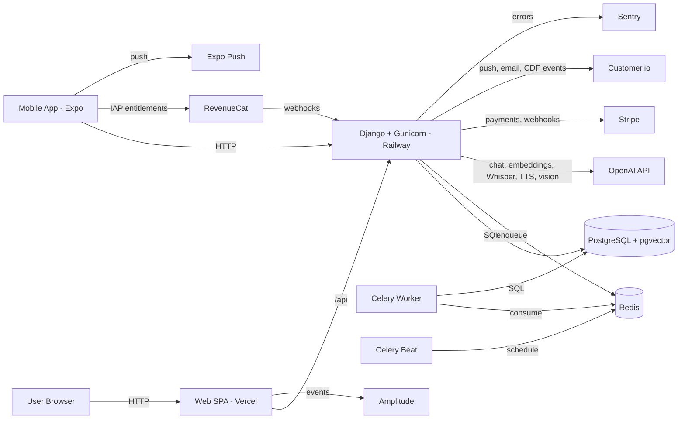
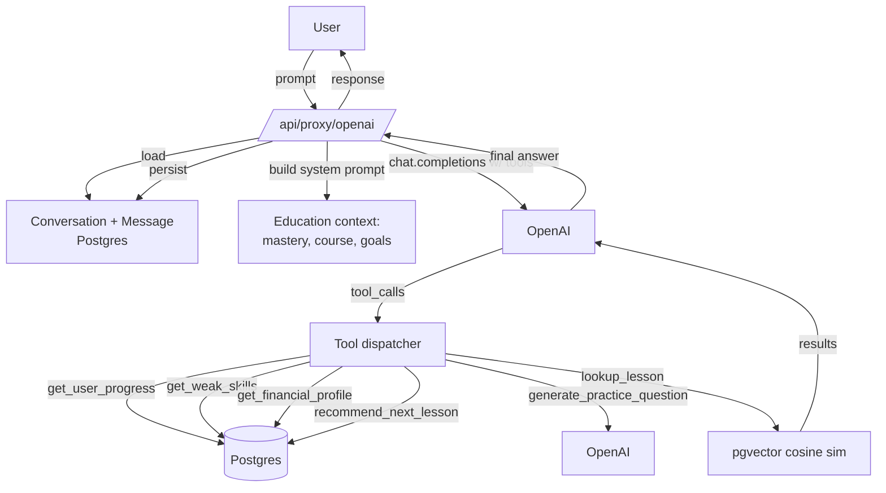
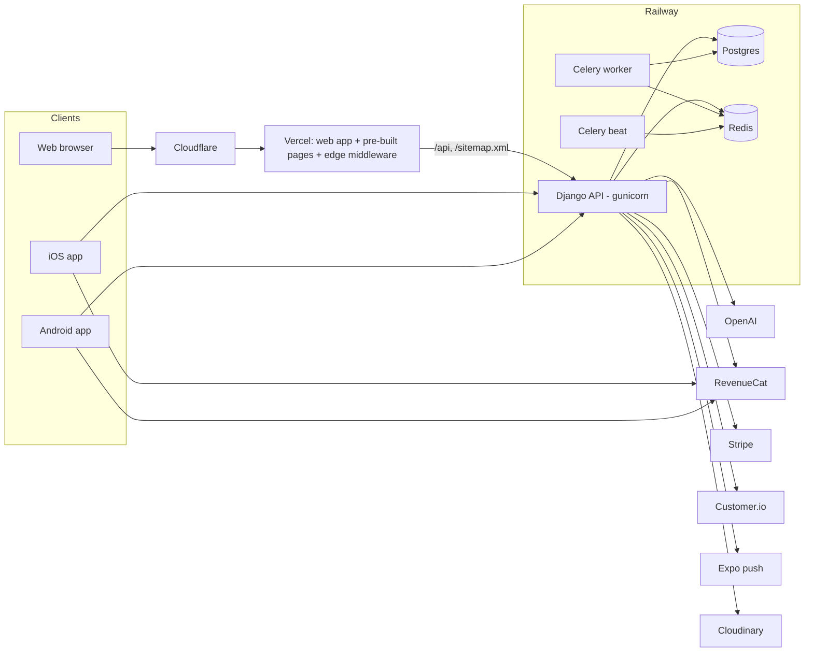

# Architecture overview

Garzoni is a pnpm-monorepo SPA + native app + API + workers, with an AI tutor layer powered by OpenAI and pgvector.

## Components

- **Web (`frontend/`)** — React 19 + Vite + Tailwind, served by Vercel.
- **Mobile (`mobile/`)** — Expo SDK 54 (React Native), distributed via App Store / Play Store. RevenueCat for IAP.
- **Shared core (`packages/core/`)** — TypeScript: API client (axios), services (auth, AI tutor, entitlements), hooks, types, i18n locales (EN + RO). Imported by both `frontend` and `mobile`.
- **Backend (`backend/`)** — Django 5.2 LTS + DRF, Gunicorn, hosted on Railway. JSON API + Django admin.
- **PostgreSQL** — Primary datastore; **pgvector** extension for AI semantic search.
- **Redis** — Celery broker + Django cache (entitlement counters, conversation summary triggers, AI nudge rate limits).
- **Celery worker + beat** — Background jobs: weekly digests, streak resets, transactional emails, AI nudge generation, embedding backfill, daily personalized-path re-eval.

## Diagram



## Tech stack

| Layer          | Tech                                                                                                                        |
| -------------- | --------------------------------------------------------------------------------------------------------------------------- |
| Web            | React 19, TypeScript, Vite 6, Tailwind 3.4 + SCSS, React Router v7                                                          |
| Mobile         | Expo SDK 54, React Native 0.81, Expo Router, expo-av (voice), expo-image-picker (scan), react-native-purchases (RevenueCat) |
| Shared         | TypeScript core package (axios client, React Query helpers, i18next)                                                        |
| State          | Zustand (client), React Query (server), React Context (theme, auth)                                                         |
| UI system      | Custom glass morphism: GlassCard, GlassContainer, GlassButton                                                               |
| Animation      | Framer Motion, Three.js (landing globe), Lottie, Canvas Confetti                                                            |
| Rich text      | CKEditor 5 (lessons), react-native-render-html (mobile)                                                                     |
| i18n           | i18next (EN + RO); locale source-of-truth in `packages/core/src/locales/`                                                   |
| Backend        | Django 5.2 LTS, DRF 3.17, Celery 5.4, Redis 5, PostgreSQL 17, pgvector (pinned, not yet adopted)                            |
| AI             | OpenAI Python SDK (gpt-4o-mini, gpt-4o, text-embedding-3-small, whisper-1, tts-1, gpt-4o vision)                            |
| Auth           | JWT (simplejwt), Google OAuth (web + mobile), Sign in with Apple (mobile), reCAPTCHA Enterprise on sensitive endpoints      |
| Payments       | Stripe (web), RevenueCat → Apple/Google IAP (mobile)                                                                        |
| Comms          | Customer.io (CDP + transactional + push), Resend (email), Expo Push                                                         |
| Observability  | Sentry (web + Django), Amplitude (web analytics)                                                                            |
| Deploy         | Vercel (web), Railway (backend, Postgres, Redis), App Store / Play Store (mobile)                                           |
| Static / media | WhiteNoise (Django statics); Cloudinary (lesson images, avatars)                                                            |

## Key directories

```
garzoni/
  frontend/src/
    components/    # 141+ React components
    contexts/      # ThemeContext, AuthContext, AdminContext
    hooks/         # Web-specific hooks
    routes/        # AppShell, AppRoutes
  mobile/
    app/           # Expo Router screens (chat, voice-chat, scan, lessons, dashboard)
    src/
      components/  # RN components
      theme/       # ThemeContext (mirrors web tokens)
  packages/core/src/
    services/      # httpClient, aiTutor, authService, entitlementsService, userService, analytics*
    hooks/         # Shared React Query hooks
    stores/        # Zustand (progress, hearts) + platform-agnostic storage adapter
    lib/           # reactQuery keys, personalizedPath, courseProgress, primaryCtaSelector
    types/         # API types
    locales/{en,ro}/  # i18n source-of-truth (common.json, shared.json, courses.json)
  packages/tokens/src/  # Spacing/radius/type scale (the only strict-mode package)
  backend/
    authentication/  # User, UserProfile, JWT, Apple/Google OAuth, entitlements, hearts, friends, RevenueCat
    education/       # Paths, courses, lessons, exercises, Mastery + SRS, translations, ContentEmbedding (RAG)
    gamification/    # XP, missions, badges, streaks, duels, wagers, leagues
    finance/         # Stripe billing, portfolio, paper trading, FunnelEvent, market-data proxies
    budgeting/       # Personal CFO: statement import, categorization, envelopes, open-banking abstraction
    support/         # AI conversation persistence, OpenAI service with tools, voice + scan endpoints, smart resume
    onboarding/      # QuestionnaireProgress (financial profile capture)
    notifications/   # Customer.io, Expo push, transactional email, Celery senders
    core/            # Health check, robots/AASA, middleware, logging (no models — slated for removal)
    settings/        # Project settings, root urls, Celery app
    tests/           # Cross-app tests
  docs/              # This directory
  .claude/context/   # Verified state of each surface + per-feature status tracker
```

> There is no `reports/` app — it was removed. `budgeting/` is the newest and most active app;
> see [`budgeting-and-open-banking.md`](budgeting-and-open-banking.md).

## AI tutor architecture

The AI tutor is a stateful agent layer wrapping OpenAI:



- **Tools**: `support/services/tools.py` defines 6 function-calling tools.
- **System prompts**: centralised in `support/prompts/tutor.py` with a `PROMPT_VERSION` for cache-busting.
- **Persistent memory**: `support.Conversation` + `support.Message` (one conversation per user × source); rolling summary above 3k tokens.
- **Quotas**: per-plan daily cap (5 / 50 / 200) + per-user daily token budget (Redis).
- **Model tiering**: `gpt-4o-mini` for Free/Plus, `gpt-4o` for Pro.
- **RAG**: lesson + course content embedded with `text-embedding-3-small`, stored in `education.ContentEmbedding` (**JSONField + Python cosine loop** — `pgvector==0.5.0` is
  pinned but no `VectorField` exists anywhere; the migration was never done).

## Reading order for new contributors

1. Top-level [`README.md`](../../README.md)
2. This file
3. [`.claude/context/00-overview.md`](../../.claude/context/00-overview.md) — orientation + the facts that surprise people
4. [`environment.md`](environment.md) — env vars
5. [`setup-local.md`](setup-local.md) or [`setup-docker.md`](setup-docker.md) — local dev
6. [`../prod/subscription-matrix.md`](../prod/subscription-matrix.md) — entitlements and prices
7. [`spacing-contract.md`](spacing-contract.md) + [`frontend-styling.md`](frontend-styling.md) — before touching any UI
8. [`.claude/context/feature-status.md`](../../.claude/context/feature-status.md) — what is actually built
9. [`../audit/platform-audit-2026-08.md`](../audit/platform-audit-2026-08.md) — open debt

---

## Platform overview (2026-10-08)

> Garzoni is a pnpm monorepo. One Django API (with Celery for background jobs) serves a React web
> app and an Expo mobile app; shared TypeScript lives in `packages/core`. The API and workers run on
> Railway, the web on Vercel behind Cloudflare, mobile builds on EAS. OpenAI powers the AI features,
> RevenueCat handles subscriptions, Customer.io handles messaging and Cloudinary hosts media.

_Last reviewed: 2026-10-08._

### Repo map

| Directory                    | What                                                                                  | Stack                                        |
| ---------------------------- | ------------------------------------------------------------------------------------- | -------------------------------------------- |
| `backend/`                   | The API, admin and background jobs                                                    | Django 5.2 LTS, DRF, Celery, Postgres, Redis |
| `frontend/`                  | Web app and public website                                                            | React 19, Vite 6, Tailwind/SCSS              |
| `mobile/`                    | iOS and Android app                                                                   | Expo SDK 54, Expo Router                     |
| `packages/core`              | Shared TypeScript: API client, services, hooks, types, translations, calculator maths | TS                                           |
| `packages/tokens`            | Spacing, radius and type scale for web and mobile                                     | TS                                           |
| `docs/`                      | Documentation, audits and runbooks (index: [`docs/README.md`](../README.md))          |                                              |
| `store-assets/`              | Store screenshot, feature graphic and In-App Event renderers                          | Node + Chrome                                |
| `ops/`, `scripts/`, `brand/` | Cloudflare worker, upload scripts, brand kit                                          |                                              |

### Backend apps

| App              | Owns                                                                                                                                     |
| ---------------- | ---------------------------------------------------------------------------------------------------------------------------------------- |
| `authentication` | Users and profiles, JWT, Google/Apple sign-in, plans and entitlements, friends, referrals, RevenueCat webhook                            |
| `education`      | Paths, courses, lessons, exercises, quizzes, mastery and spaced repetition, translations, embeddings, public lessons and guides, sitemap |
| `gamification`   | XP, missions, badges, streaks, duels, wagers, leagues                                                                                    |
| `finance`        | Market data, portfolio, Stripe, funnel analytics, news                                                                                   |
| `budgeting`      | Personal CFO: statement import, categorisation, budget envelopes, open-banking abstraction (disabled)                                    |
| `support`        | AI tutor, voice tutor, receipt scan, smart resume, contact and feedback                                                                  |
| `onboarding`     | The versioned questionnaire and plan summary                                                                                             |
| `notifications`  | Customer.io, Expo push, email fallback, frequency caps                                                                                   |
| `core`           | Health check, robots, Apple app-site association, middleware                                                                             |

All endpoints sit under a flat `/api/`. Live API docs: `/api/docs/`.

### Runtime services



Errors from all three clients and the API go to Sentry.

### Environments and deploy

| Surface           | Host                                      | Deploys                                                                                               |
| ----------------- | ----------------------------------------- | ----------------------------------------------------------------------------------------------------- |
| Web               | Vercel                                    | Every push to `master`; the production build pre-renders all public pages and fails if any is missing |
| API, worker, beat | Railway (three services, one image)       | Every push to `master`; the API has a `/health/` check, the Celery services have none                 |
| Mobile            | EAS Build, then App Store and Google Play | Manual: build, upload, submit; store metadata via `eas metadata:push`                                 |
| Database          | Railway Postgres                          | Backups before risky changes; never push local content over production                                |

Local development: `make dev` (Docker: API, Postgres, Redis), `pnpm dev` (web), and
`pnpm --filter @garzoni/mobile start` (Metro). Use `make dev`, not plain `docker compose up`, which
picks up a stale database login from `backend/.env`.

CI runs on every push: type checks, lint, formatting, web and backend tests, and a Python dependency
audit. The same gates run locally through the husky pre-commit hook.

### Internationalisation

- UI strings live in `packages/core/src/locales/{en,ro}/` and are shared by web and mobile. Every new
  string needs both languages.
- Course content is translated into per-language rows (`*Translation` models) with an OpenAI
  pipeline (`translate_lessons_to_ro`, `translate_standalone_exercises_to_ro`,
  `translate_articles_to_ro`). The API serves the Romanian row when it exists and English otherwise.
- The public website publishes a Romanian page only when the whole lesson or guide is translated.

### Content operations

- Lessons, courses and guides are edited in the Django admin or created by seed commands in
  `backend/education/management/commands/`.
- Translations run **on production** for production content (`railway ssh --service garzoni -- python
manage.py ...`), always with `--dry-run` first. Production content is ahead of local, so local
  Romanian rows must never be pushed over production.
- Which lessons are public is a rule, not a manual list: curated lessons plus the first lesson of
  every active course.

### Where to read more

| Topic                                 | Doc                                                                                                          |
| ------------------------------------- | ------------------------------------------------------------------------------------------------------------ |
| Architecture detail                   | [`docs/dev/architecture.md`](architecture.md)                                                                |
| Environment variables and local setup | [`docs/dev/environment.md`](environment.md), [`docs/dev/setup-docker.md`](setup-docker.md)                   |
| Production runbook                    | [`docs/prod/railway-production-runbook.md`](../prod/railway-production-runbook.md)                           |
| Releasing the apps                    | [`docs/prod/pre-release-checklist.md`](../prod/pre-release-checklist.md)                                     |
| Styling and design tokens             | [`docs/dev/frontend-styling.md`](frontend-styling.md), [`docs/dev/spacing-contract.md`](spacing-contract.md) |
| Error reporting                       | [`docs/dev/error-reporting.md`](error-reporting.md)                                                          |
