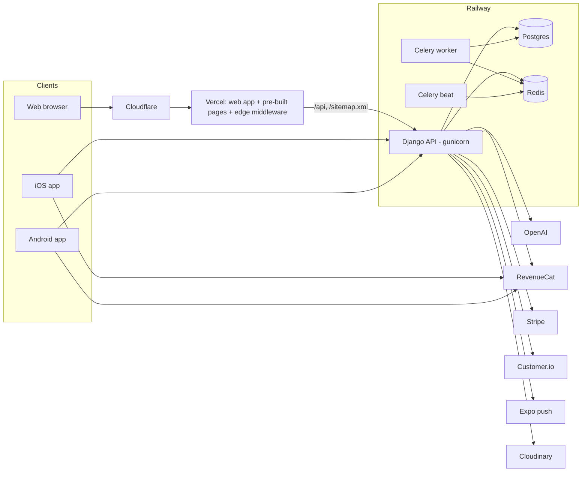

# Platform and architecture

> Garzoni is a pnpm monorepo. One Django API (with Celery for background jobs) serves a React web
> app and an Expo mobile app; shared TypeScript lives in `packages/core`. The API and workers run on
> Railway, the web on Vercel behind Cloudflare, mobile builds on EAS. OpenAI powers the AI features,
> RevenueCat handles subscriptions, Customer.io handles messaging and Cloudinary hosts media.

_Last reviewed: 2026-10-08._

## Repo map

| Directory                    | What                                                                                  | Stack                                        |
| ---------------------------- | ------------------------------------------------------------------------------------- | -------------------------------------------- |
| `backend/`                   | The API, admin and background jobs                                                    | Django 5.2 LTS, DRF, Celery, Postgres, Redis |
| `frontend/`                  | Web app and public website                                                            | React 19, Vite 6, Tailwind/SCSS              |
| `mobile/`                    | iOS and Android app                                                                   | Expo SDK 54, Expo Router                     |
| `packages/core`              | Shared TypeScript: API client, services, hooks, types, translations, calculator maths | TS                                           |
| `packages/tokens`            | Spacing, radius and type scale for web and mobile                                     | TS                                           |
| `docs/`                      | Documentation, audits and runbooks (index: [`docs/README.md`](../README.md))          |                                              |
| `store-assets/`              | Store screenshot, feature graphic and In-App Event renderers                          | Node + Chrome                                |
| `ops/`, `scripts/`, `brand/` | Cloudflare worker, upload scripts, brand kit                                          |                                              |

### Backend apps

| App              | Owns                                                                                                                                     |
| ---------------- | ---------------------------------------------------------------------------------------------------------------------------------------- |
| `authentication` | Users and profiles, JWT, Google/Apple sign-in, plans and entitlements, friends, referrals, RevenueCat webhook                            |
| `education`      | Paths, courses, lessons, exercises, quizzes, mastery and spaced repetition, translations, embeddings, public lessons and guides, sitemap |
| `gamification`   | XP, missions, badges, streaks, duels, wagers, leagues                                                                                    |
| `finance`        | Market data, portfolio, Stripe, funnel analytics, news                                                                                   |
| `budgeting`      | Personal CFO: statement import, categorisation, budget envelopes, open-banking abstraction (disabled)                                    |
| `support`        | AI tutor, voice tutor, receipt scan, smart resume, contact and feedback                                                                  |
| `onboarding`     | The versioned questionnaire and plan summary                                                                                             |
| `notifications`  | Customer.io, Expo push, email fallback, frequency caps                                                                                   |
| `core`           | Health check, robots, Apple app-site association, middleware                                                                             |

All endpoints sit under a flat `/api/`. Live API docs: `/api/docs/`.

## Runtime services

Errors from all three clients and the API go to Sentry.

## Environments and deploy

| Surface           | Host                                      | Deploys                                                                                               |
| ----------------- | ----------------------------------------- | ----------------------------------------------------------------------------------------------------- |
| Web               | Vercel                                    | Every push to `master`; the production build pre-renders all public pages and fails if any is missing |
| API, worker, beat | Railway (three services, one image)       | Every push to `master`; the API has a `/health/` check, the Celery services have none                 |
| Mobile            | EAS Build, then App Store and Google Play | Manual: build, upload, submit; store metadata via `eas metadata:push`                                 |
| Database          | Railway Postgres                          | Backups before risky changes; never push local content over production                                |

Local development: `make dev` (Docker: API, Postgres, Redis), `pnpm dev` (web), and
`pnpm --filter @garzoni/mobile start` (Metro). Use `make dev`, not plain `docker compose up`, which
picks up a stale database login from `backend/.env`.

CI runs on every push: type checks, lint, formatting, web and backend tests, and a Python dependency
audit. The same gates run locally through the husky pre-commit hook.

## Internationalisation

- UI strings live in `packages/core/src/locales/{en,ro}/` and are shared by web and mobile. Every new
  string needs both languages.
- Course content is translated into per-language rows (`*Translation` models) with an OpenAI
  pipeline (`translate_lessons_to_ro`, `translate_standalone_exercises_to_ro`,
  `translate_articles_to_ro`). The API serves the Romanian row when it exists and English otherwise.
- The public website publishes a Romanian page only when the whole lesson or guide is translated.

## Content operations

- Lessons, courses and guides are edited in the Django admin or created by seed commands in
  `backend/education/management/commands/`.
- Translations run **on production** for production content (`railway ssh --service garzoni -- python
manage.py ...`), always with `--dry-run` first. Production content is ahead of local, so local
  Romanian rows must never be pushed over production.
- Which lessons are public is a rule, not a manual list: curated lessons plus the first lesson of
  every active course.

## Where to read more

| Topic                                 | Doc                                                                                                                        |
| ------------------------------------- | -------------------------------------------------------------------------------------------------------------------------- |
| Architecture detail                   | [`docs/dev/architecture.md`](../dev/architecture.md)                                                                       |
| Environment variables and local setup | [`docs/dev/environment.md`](../dev/environment.md), [`docs/dev/setup-docker.md`](../dev/setup-docker.md)                   |
| Production runbook                    | [`docs/prod/railway-production-runbook.md`](../prod/railway-production-runbook.md)                                         |
| Releasing the apps                    | [`docs/prod/pre-release-checklist.md`](../prod/pre-release-checklist.md)                                                   |
| Styling and design tokens             | [`docs/dev/frontend-styling.md`](../dev/frontend-styling.md), [`docs/dev/spacing-contract.md`](../dev/spacing-contract.md) |
| Error reporting                       | [`docs/dev/error-reporting.md`](../dev/error-reporting.md)                                                                 |
